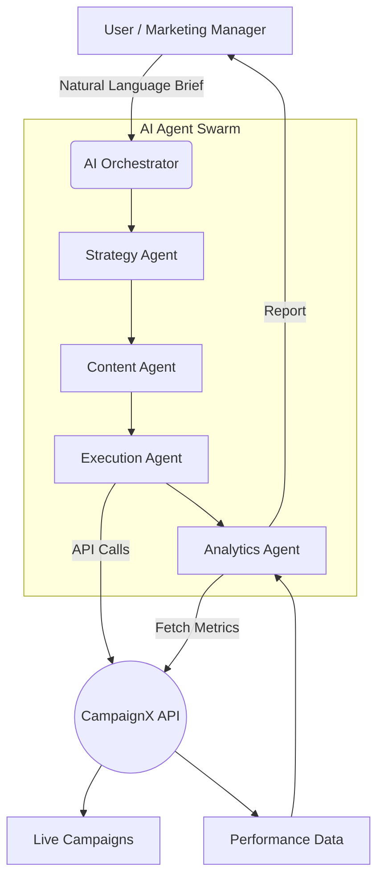

<div align="center">

# 🤖 XDeposit AI Marketing Agent
### Autonomous AI Marketing System for SuperBFSI

[]()
[]()

> A fully autonomous AI system that handles the entire marketing workflow for SuperBFSI's premium term deposit product, XDeposit—without requiring a human marketing team.

</div>

---

## 🎯 Problem Statement

Modern financial institutions struggle with the agility and overhead required to launch marketing campaigns rapidly. The goal of this project is to build an autonomous AI marketing agent for a hypothetical BFSI company called **SuperBFSI**. 

Specifically, the system focuses on marketing **XDeposit**—a high-return term deposit product offering bonus interest rates for female senior citizens. The AI must be capable of understanding raw marketing briefs, devising a campaign strategy, generating content, and utilizing APIs to automatically deploy and monitor the campaign.

---

## 📖 Project Overview

The **XDeposit AI Marketing Agent** acts as an end-to-end digital marketing team. By simply providing a natural language brief, the AI system takes over the entire lifecycle of a marketing campaign. It strategically identifies the target demographic (female senior citizens), highlights the unique selling propositions (better returns/bonus benefits), generates compelling copy, and interacts directly with the **CampaignX API** to launch and track the campaign.

---

## ✨ Key Features

- **🧠 Natural Language Brief Processing:** Understands plain-text marketing objectives and extracts key parameters.
- **📊 Strategic Campaign Generation:** Automatically formulates targeting strategies, budget allocation, and ad copy.
- **🔌 Seamless API Integration:** Interacts directly with ad-networks via the CampaignX API.
- **🚀 One-Click Autonomous Launch:** Provisions the audience, creates the ad, and publishes the campaign programmatically.
- **📈 Real-Time Performance Monitoring:** Fetches campaign analytics to measure reach, engagement, and conversion.

---

## 🏗️ System Architecture



---

## ⚙️ AI Agent Workflow

1. **Input Phase:** The user provides a simple text prompt (e.g., *"We are launching XDeposit. It has 8% interest and a 0.5% bonus for female senior citizens. Run a campaign to get 1000 leads."*).
2. **Strategy formulation (Strategy Agent):** Analyzes the brief, identifies the Exact Target Audience (Females, Age 60+), and defines the core messaging.
3. **Content Creation (Content Agent):** Drafts the ad title, description, and determines the best call-to-action (CTA).
4. **API Execution (Execution Agent):** 
   - Calls the API to create the campaign container.
   - Calls the API to set the granular audience targeting rules.
   - Calls the API to publish the campaign live.
5. **Monitoring (Analytics Agent):** Continuously queries the analytics endpoint to summarize impressions, clicks, and ROI back to the user.

---

## 💻 Tech Stack

- **Core AI:** Large Language Models (LLMs), LangChain / LlamaIndex for Agentic Swarms
- **Backend:** Python, FastAPI
- **Frontend/UI:** React (Vite.js) & TailwindCSS v4
- **External Integration:** CampaignX API
- **Database:** Internal Logging (Mocked for Hackathon logic)

---

## 🔗 API Integrations

The system relies heavily on automated API calls to bypass structural human dependencies. We execute standard RESTful HTTP requests to interact with ad networks, ensuring that targeting, publishing, and monitoring are entirely code-driven.

### 📦 CampaignX API Usage 

Below is the detailed breakdown of the CampaignX API endpoints (v1) integrated into our workflow:

#### 1. Create Campaign
- **Name:** Campaign Creation API
- **Endpoint:** `POST /api/v1/campaigns`
- **Function:** Initializes a new campaign draft in the CampaignX system.
- **Where it is used:** Used by the Execution Agent immediately after the strategy phase to create the main campaign container.
- **Request Format:**
  ```json
  {
    "name": "XDeposit Senior Citizen Promo",
    "budget": 5000,
    "currency": "USD",
    "objective": "LEAD_GENERATION"
  }
  ```
- **Response Format:**
  ```json
  {
    "campaign_id": "CMP-98765",
    "status": "DRAFT",
    "created_at": "2023-10-25T10:00:00Z"
  }
  ```

#### 2. Audience Targeting
- **Name:** Audience Definition API
- **Endpoint:** `POST /api/v1/campaigns/{campaign_id}/audience`
- **Function:** Attaches specific demographic targeting rules to the campaign.
- **Where it is used:** Used by the Execution Agent to ensure the ads only reach female senior citizens.
- **Request Format:**
  ```json
  {
    "demographics": {
      "age_min": 60,
      "age_max": 100,
      "gender": "FEMALE"
    },
    "interests": ["Retirement Planning", "Fixed Deposits", "Investment"]
  }
  ```
- **Response Format:**
  ```json
  {
    "audience_id": "AUD-12345",
    "estimated_reach": 250000,
    "status": "APPLIED"
  }
  ```

#### 3. Campaign Publishing
- **Name:** Publish Campaign API
- **Endpoint:** `POST /api/v1/campaigns/{campaign_id}/publish`
- **Function:** Transitions the campaign from "DRAFT" to "ACTIVE", spending real budget.
- **Where it is used:** The final step for the Execution Agent once the content and audience have been verified.
- **Request Format:**
  ```json
  {
    "scheduled_start": "NOW",
    "auto_optimize": true
  }
  ```
- **Response Format:**
  ```json
  {
    "campaign_id": "CMP-98765",
    "status": "ACTIVE",
    "message": "Campaign is now live."
  }
  ```

#### 4. Analytics and Monitoring
- **Name:** Campaign Analytics API
- **Endpoint:** `GET /api/v1/campaigns/{campaign_id}/analytics`
- **Function:** Retrieves real-time performance metrics for a running campaign.
- **Where it is used:** Used periodically by the Analytics Agent to compile health reports.
- **Request Format:** *No request body. Query parameter based.*
- **Response Format:**
  ```json
  {
    "impressions": 15420,
    "clicks": 1023,
    "leads": 45,
    "spend": 120.50
  }
  ```


## 🛠️ Installation Guide

1. **Clone the repository:**
   ```bash
   git clone https://github.com/yourusername/xdeposit-ai-agent.git
   cd xdeposit-ai-agent
   ```

2. **Backend Setup:**
   ```bash
   cd backend
   python -m venv venv
   source venv/bin/activate  # On Windows: venv\Scripts\activate
   pip install -r requirements.txt
   ```

3. **Frontend Setup:**
   ```bash
   cd ../frontend
   npm install
   ```

---

## 🔐 Environment Variables

Create a `.env` file in the `backend` directory based on `.env.example`:

```ini
# LLM Provider Key (OpenAI / Anthropic / Gemini)
OPENAI_API_KEY=your_llm_api_key_here

# CampaignX API Credentials
CAMPAIGNX_API_URL=https://api.campaignx.com
CAMPAIGNX_API_KEY=your_campaignx_api_key
CAMPAIGNX_SECRET=your_campaignx_secret
```

---

## 🚀 How to Run the Project

1. **Start the Backend Server:**
   ```bash
   cd backend
   uvicorn main:app --reload --port 8000
   ```
2. **Start the Frontend Application:**
   ```bash
   cd ../frontend
   npm run dev
   ```
3. **Access the Dashboard:**
   Open your browser and navigate to the endpoint provided by Vite (usually `http://localhost:5173`).

---

## 📝 Example Workflow

1. Navigate to the AI Marketing Dashboard.
2. In the prompt box, paste the following brief:
   > *"Launch a campaign for SuperBFSI's new XDeposit. Target demographic is females over 60. Highlight the 0.5% bonus interest rate. Set the budget to $5000."*
3. Click **"Generate & Deploy"**.
4. Observe the UI logs as the AI Agents automatically strategize, call the CampaignX APIs via backend wrappers, and return the live `campaign_id`.
5. Visual confirmations of Live execution are seamlessly integrated into the right-hand container.

---

## 📸 Screenshots

*(Replace these placeholders with actual screenshots of your application)*

| Dashboard Interface | AI Agent Thought Process | Campaign Analytics |
|:---:|:---:|:---:|
|  |  |  |

---

## 🔮 Future Improvements

- **Multi-Channel Publishing:** Extend support beyond CampaignX to platforms like Google Ads and Meta Ads.
- **A/B Testing Agents:** Allow the AI to automatically run parallel copy variations and pause the underperforming ones.
- **Image Generation:** Integrate DALL-E 3 or Midjourney APIS so the Content Agent can generate corresponding visual creatives.

---

## 👥 Contributors

- **[Pranshu Samadhiya]** - *AI Engineer & Full Stack Developer* - [GitHub](https://github.com/pranshu-samadhiya)
