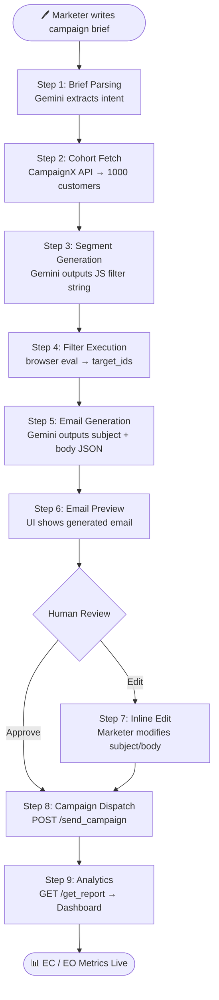

# AI Agent Workflow — CampX

## Overview

CampX implements a **multi-step autonomous AI agent** powered by Google Gemini 2.5 Flash. The agent does NOT require pre-programmed rules — it reads plain English and makes intelligent decisions at each step.

The agent follows a **Human-in-the-Loop (HITL)** design: AI handles heavy lifting while a human marketer retains final approval authority.

---

## End-to-End Workflow



---

## Step-by-Step Detail

### Step 1 — Brief Parsing

The marketer enters a campaign brief in plain text. Example:
> *"Run email campaign for XDeposit. Offer 1% higher returns than competitors. Give additional 0.25% benefits to female senior citizens. Include this link: https://superbfsi.com/xdeposit/explore/"*

**Gemini prompt** (condensed):
```
You are an AI Marketing Assistant. Based on the following brief, generate a comprehensive email campaign.
Brief: {brief}

Return JSON:
{
  "strategy": "...",
  "targetSegment": "...",
  "sendTime": "7:00 PM",
  "estimatedAudience": "...",
  "subject": "...",
  "body": "...",
  "explanation": { "audience": "...", "sendTime": "...", "tone": "..." }
}
```

**Gemini output (example)**:
```json
{
  "strategy": "Target female senior citizens with high income and existing customer status",
  "targetSegment": "Female customers aged 60+ with monthly income > 80,000",
  "sendTime": "7:00 PM",
  "estimatedAudience": "~120 customers",
  "subject": "Exclusive XDeposit Offer: Higher Returns + Special Bonus For You",
  "body": "Dear [Name], We have an exclusive offer..."
}
```

---

### Step 2 — Customer Cohort Fetch

```http
GET /api/v1/get_customer_cohort
X-API-Key: {team_api_key}
```

Returns up to 1,000 customers with fields:
`customer_id`, `Full_name`, `Age`, `Gender`, `Monthly_Income`, `KYC status`,
`App_Installed`, `Existing Customer`, `Credit score`, `City`, `Social_Media_Active`, etc.

---

### Step 3 — AI Filter Generation

A second Gemini call generates a **JavaScript arrow function** that filters the cohort based on `targetSegment`:

**Prompt:**
```
You are a data analyst. I have a marketing campaign targeting: "{targetSegment}".
Return ONLY a JavaScript filter function string that I can run via eval().
Example: (c) => c['Gender'] === 'Female' && c['Age'] >= 60

Customer keys available:
- "customer_id", "Full_name", "Email", "City" (strings)
- "Age", "Monthly_Income", "Kids_in_Household", "Credit score" (numbers)
- "Gender" (string: "Male" or "Female")
- "KYC status", "App_Installed", "Existing Customer", "Social_Media_Active" (string: "Y" or "N")

Return ONLY the raw arrow function string. No markdown, no explanation.
```

**Gemini output (example):**
```js
(c) => c['Gender'] === 'Female' && c['Age'] >= 60 && c['Monthly_Income'] > 80000
```

---

### Step 4 — Filter Execution

The filter string is applied in the browser:

```js
const filterFn = eval(filterFuncString);
const filteredCohort = rawCohort.filter(filterFn);
const target_customer_ids = filteredCohort.map(c => c.customer_id);
```

**Fallback:** If `eval()` throws, the system falls back to selecting the top 10% of the cohort by default, ensuring the campaign still dispatches.

---

### Step 5 — Email Generation

Email content (`subject` + `body`) is extracted from the Step 1 JSON response. No additional API call needed.

---

### Step 6 — Human Review & Editing

The marketer sees a preview of the generated email:

```
SUBJECT: Exclusive XDeposit Offer: Higher Returns + Special Bonus For You
──────────────────────────────────────────────────────────────────
BODY:
Dear Valued Customer,

We are thrilled to offer you a special XDeposit opportunity...
```

**Edit Email Feature:**
- Clicking **✏️ Edit Email** converts fields to editable inputs
- Subject → `<input>` field
- Body → `<textarea>` field
- Clicking **💾 Save Changes** commits edits back to campaign state

---

### Step 7 — Feedback Regeneration

If the marketer provides written feedback:
> *"Make it more formal, shorter, remove emojis"*

The brief is re-sent to Gemini with the feedback appended, and a fresh campaign is generated.

---

### Step 8 — Campaign Dispatch

```http
POST /api/v1/send_campaign
X-API-Key: {team_api_key}
Content-Type: application/json

{
  "subject": "Exclusive XDeposit Offer...",
  "body": "Dear Valued Customer...",
  "list_customer_ids": ["CUST0042", "CUST0115", "CUST0387", ...],
  "send_time": "10:03:26 18:00:00"
}
```

Response:
```json
{ "campaign_id": "abc123-...", "status": "scheduled" }
```

The `campaign_id` is stored in `localStorage` for dashboard retrieval.

---

### Step 9 — Analytics & Reporting

```http
GET /api/v1/get_report?campaign_id=abc123
X-API-Key: {team_api_key}
```

Returns per-customer engagement events. Dashboard aggregates:
- **Open Rate** (EO = Y count / total sent)
- **Click Rate** (EC = Y count / total sent)
- **Unsubscribe Rate** (EU = Y count / total sent)
- Time-series charts for day-of-week analysis

---

## Prompt Engineering Principles

| Principle | Implementation |
|-----------|---------------|
| **Strict JSON output** | `responseMimeType: "application/json"` in Gemini config |
| **Field name awareness** | Prompts include exact CampaignX field names to reduce hallucinations |
| **Fallback safety** | `eval()` wrapped in try/catch with 10% fallback sampling |
| **Regeneration context** | Feedback text is appended to original brief in regen prompts |
| **Token efficiency** | Step 3 uses a minimal prompt (no JSON required, just a function string) |
