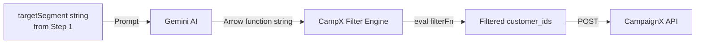

# AI Targeting Logic — CampX

## Overview

One of CampX's most innovative features is its **AI-generated demographic filter**. Rather than building a rigid rule engine with hardcoded targeting options, CampX delegates the targeting logic entirely to Gemini AI — which writes executable JavaScript code tailored to each campaign brief.

---

## The Problem

CampaignX provides raw customer data (1,000 records per cohort) with no built-in filtering capabilities. Every campaign needs to reach the *right* customers — not all 1,000.

**Example requirement:**
> "Target female senior citizens with high income who are existing customers"

This needs to be converted into executable logic that works against the actual data schema.

---

## The Solution: AI-Generated Filter Functions

Instead of pre-programming every possible demographic combination, CampX sends a **natural language segment description** to Gemini and receives back a **JavaScript arrow function** ready to be applied via `Array.filter()`.

### How It Works



### Prompt Template

```
You are a data analyst. I have a marketing campaign targeting: "{targetSegment}".

Return ONLY a JavaScript filter function string that I can run via eval().
For example: (c) => c['Gender'] === 'Female' && c['Age'] >= 60

Customer keys available:
- "customer_id", "Full_name", "Email", "City" (strings)
- "Age", "Monthly_Income", "Kids_in_Household", "Credit score" (numbers)
- "Gender": "Male" or "Female"
- "KYC status", "App_Installed", "Existing Customer", "Social_Media_Active": "Y" or "N"

Return ONLY the raw arrow function string. Use bracket notation for keys with spaces.
Do NOT write markdown blocks, do NOT write explanations.
```

---

## Real Examples

| Campaign Brief Segment | AI-Generated Filter |
|------------------------|---------------------|
| Female senior citizens | `(c) => c['Gender'] === 'Female' && c['Age'] >= 60` |
| High income existing customers | `(c) => c['Monthly_Income'] > 100000 && c['Existing Customer'] === 'Y'` |
| Young app users with good credit | `(c) => c['Age'] <= 35 && c['App_Installed'] === 'Y' && c['Credit score'] >= 650` |
| Social media active females | `(c) => c['Gender'] === 'Female' && c['Social_Media_Active'] === 'Y'` |
| All KYC-verified customers | `(c) => c['KYC status'] === 'Y'` |

---

## Filter Execution Code

```js
let filterFuncString = "(c) => true"; // Safe fallback

try {
  const filterRes = await ai.models.generateContent({
    model: "gemini-2.5-flash",
    contents: filterPrompt,
  });
  filterFuncString = filterRes.text
    ?.replace(/`/g, "")
    .replace(/javascript/g, "")
    .trim() || "(c) => true";
} catch (e) {
  addLog("Failed to generate AI filter, using fallback...", "info");
}

// Apply filter
let target_customer_ids = [];
try {
  const filterFunc = eval(filterFuncString);
  const filteredCohort = rawCohort.filter(filterFunc);
  target_customer_ids = filteredCohort
    .map(c => c.customer_id)
    .filter(Boolean);

  addLog(`Filtered: ${target_customer_ids.length} matched out of ${rawCohort.length}`, "success");
} catch (err) {
  // Fallback: 10% random sample
  target_customer_ids = rawCohort
    .map(c => c.customer_id)
    .slice(0, Math.max(1, Math.floor(rawCohort.length * 0.1)));

  addLog(`Fallback triggered: ${target_customer_ids.length} selected`, "info");
}
```

---

## Safety & Fallback Design

| Scenario | Behavior |
|----------|----------|
| Gemini returns valid function | Applied normally |
| Gemini adds markdown (``` ```js ```) | Stripped via `.replace(/\`/g, "")` |
| `eval()` throws syntax error | 10% random cohort fallback |
| Zero customers matched | Campaign aborted with log message |

> ⚠️ **Security Note:** The `eval()` call only runs AI-generated filter functions in a sandboxed browser context operating on non-sensitive mock data. This is appropriate for a hackathon prototype. In production, this would use a safer server-side evaluation sandbox.

---

## Why This Approach Wins

| Traditional Approach | CampX AI Approach |
|----------------------|-------------------|
| Fixed dropdowns (Age, Gender) | Any natural language segment |
| Limited combinations | Unlimited logical combinations |
| Requires engineering per segment | Zero-code targeting |
| Inflexible | Adapts to any campaign brief |

---

## XDeposit-Specific Targeting

For the XDeposit campaign, the optimal filter to maximize EC/EO scores targets:

```js
(c) => 
  c['Existing Customer'] === 'Y' &&       // Already trust SuperBFSI
  c['KYC status'] === 'Y' &&              // Legally eligible
  c['App_Installed'] === 'Y' &&           // Digitally engaged
  c['Monthly_Income'] > 80000             // Can invest in term deposit
```

**Or for the female senior citizen bonus:**
```js
(c) => c['Gender'] === 'Female' && c['Age'] >= 60 && c['Monthly_Income'] > 50000
```
