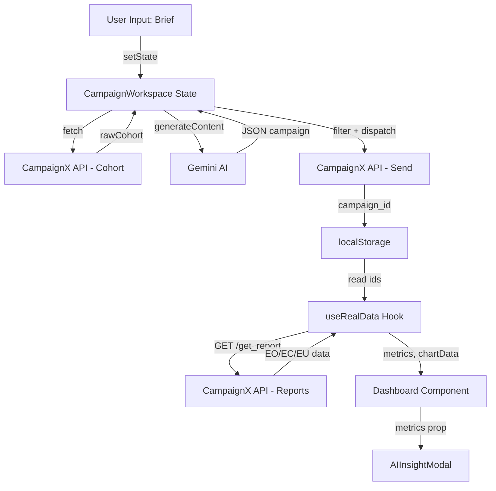

# Frontend Architecture — CampX

## Overview

CampX is built as a **single-page React application (SPA)** using Vite as the build tool. The UI is organized into focused, reusable components with local state management. There is no backend — all logic runs in the browser and communicates directly with external APIs.

---

## Component Tree

```
App.jsx
├── Sidebar Navigation
│   ├── New Campaign → CampaignWorkspace.jsx
│   ├── Dashboard → Dashboard.jsx
│   ├── Trends → (chart views)
│   └── Email Activity → (campaign list)
│
├── CampaignWorkspace.jsx          ← Main campaign creation component
│   └── ScheduleSection.jsx        ← Date/time picker for campaign scheduling
│
├── Dashboard.jsx                  ← Analytics and metrics display
│   └── AIInsightModal.jsx         ← Gemini-powered AI analysis modal
│
└── Settings.jsx                   ← API key override settings
```

---

## Key Components

### `CampaignWorkspace.jsx`

The heart of CampX. Handles the complete campaign lifecycle.

**State:**
```js
const [brief, setBrief] = useState("");            // Campaign brief text
const [campaign, setCampaign] = useState(null);    // AI-generated campaign object
const [rawCohort, setRawCohort] = useState([]);    // Live customer list from API
const [isGenerating, setIsGenerating] = useState(false);
const [isApproved, setIsApproved] = useState(false);
 
const [schedule, setSchedule] = useState(INITIAL_SCHEDULE);
const [error, setError] = useState(null);
const [feedback, setFeedback] = useState("");      // Human feedback for regen

// Edit Email feature
const [isEditingEmail, setIsEditingEmail] = useState(false);
const [emailSubject, setEmailSubject] = useState("");
const [emailBody, setEmailBody] = useState("");
```

**Key Functions:**
```js
generateCampaign(isRegeneration = false)  // AI generation + cohort fetch
executeCampaign()                          // Filter + dispatch via API
addLog(message, status)                   // Activity log helper
```

---

### `useRealData.js` (Custom Hook)

Fetches and aggregates analytics data from all campaign reports.

**State exposed:**
```js
return { reports, metrics, chartData, isLoading };
```

**`metrics` object:**
```js
{
  totalSent: "408",      // Total emails sent
  openRate: "12.5%",     // EO = Y percentage
  clickRate: "3.2%",     // EC = Y percentage
  unsubscribes: "0.49%", // EU = Y percentage
  openRateTrend: "up",
  clickRateTrend: "up",
}
```

**`chartData` object:**
```js
{
  openRateData: [{ name: "Mon", value: 14.2 }, ...],
  clickRateBySegment: [{ name: "Retail", value: 2.1 }, ...],
  engagementTrend: [{ name: "W1", value: 45 }, ...],
  dailyVolume: [...],
  genderEngagement: [{ name: "Male", value: 210 }, { name: "Female", value: 198 }],
  ageGroupEngagement: [...],
  weeklyCampaigns: [...],
}
```

**Field Compatibility:**
The hook checks multiple field name variants for maximum API compatibility:
```js
if (ev.EO === "Y" || ev.Open === "Y" || ev.open === "Y" || ev.eo === "Y") opens++;
if (ev.EC === "Y" || ev.Click === "Y" || ev.click === "Y" || ev.ec === "Y") clicks++;
```

---

### `AIInsightModal.jsx`

A modal that uses Gemini to analyze live dashboard metrics and return actionable insights.

**Props:** `{ isOpen, onClose, metrics, chartData }`

**Behavior:**
1. Triggers on modal open
2. Sends metrics to Gemini with `responseMimeType: "application/json"`
3. Parses response as array of 3 insight objects
4. Renders with impact badges (Critical / High Impact / Medium Impact)

---

### `ScheduleSection.jsx`

A reusable scheduling widget allowing the marketer to set:
- **Date** (HTML date picker)
- **Time** (HTML time picker)
- **Type** (one-time / recurring)

Passed as `schedule` prop to `CampaignWorkspace` for use in send time formatting.

---

## Data Flow Diagram



---

## Technology Decisions

| Choice | Alternative Considered | Reason |
|--------|----------------------|--------|
| **Vite** | Create React App | 10x faster HMR, smaller bundle size |
| **Local state (useState)** | Redux / Zustand | No cross-component shared state needed |
| **Framer Motion** | CSS animations | Smooth enter/exit animations for cards and modals |
| **Recharts** | Chart.js / D3 | React-native, declarative, excellent defaults |
| **Tailwind CSS** | CSS Modules | Rapid development, consistent utility classes |
| **@google/genai SDK** | Raw fetch to REST API | Reliable JSON mode support, type-safe responses |

---

## Build & Bundle

```bash
npm run build   # Vite production build → dist/
npm run dev     # Development server on :3000 with HMR
```

**Production bundle characteristics:**
- Tree-shaken, minified
- Environment variables inlined by Vite (`import.meta.env.*`)
- Single-page with client-side routing
