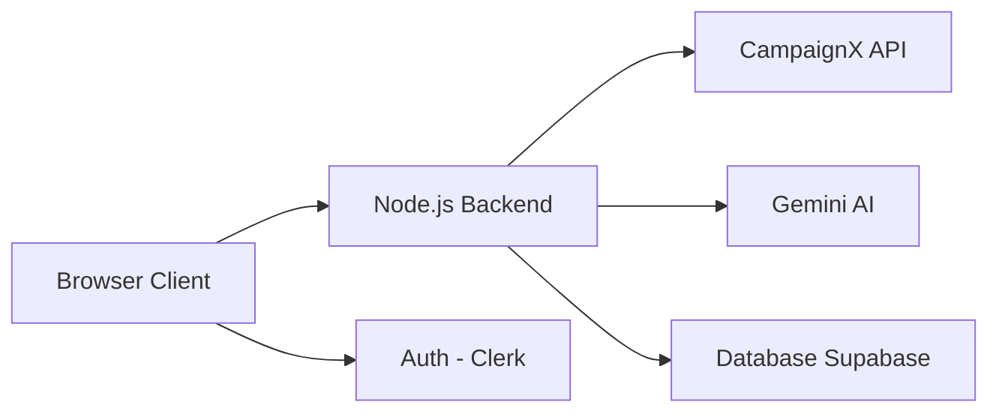
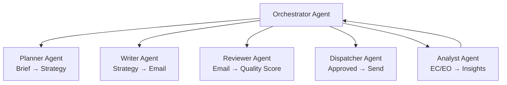

# Future Improvements — CampX

## Overview

CampX was built as a hackathon prototype in a compressed timeline. While it demonstrates a fully autonomous AI marketing agent end-to-end, there are many exciting directions to evolve it into a production-grade BFSI marketing platform.

---

## Current Limitations

| Limitation | Impact | Priority to Fix |
|------------|--------|----------------|
| Browser-only `eval()` for filtering | Security concern in production | High |
| No persistent database | Campaign history lost on browser clear | High |
| Single-user session (no auth) | Not multi-team ready | High |
| No A/B testing | Can't compare campaign variants | Medium |
| Rate-limited API (100/day) | Restricts rapid experimentation | Medium |
| No real-time webhook for EO/EC | Dashboard requires manual refresh | Medium |
| Static cohort (fetched once) | No live customer updates | Low |

---

## Roadmap

### Phase 1 — Production Hardening (1-2 weeks)

| Feature | Description |
|---------|-------------|
| **Authentication** | Add Clerk or Firebase Auth for multi-user access |
| **Persistent Campaign Store** | Replace localStorage with Supabase or Firebase Realtime DB |
| **Server-side Filter Execution** | Move `eval()` to a Node.js/Python backend sandbox |
| **Error Monitoring** | Add Sentry for runtime error tracking |
| **Rate Limit Management** | Queue API calls, batch reports intelligently |



---

### Phase 2 — AI Agent Upgrades (2-4 weeks)

| Feature | Description |
|---------|-------------|
| **Multi-Agent Architecture** | Separate Planner, Writer, and Reviewer agents with handoffs |
| **Autopilot Mode** | Schedule 24/7 autonomous campaign generation and dispatch |
| **Per-Customer Personalization** | Generate unique email body per customer using their name, city, and income tier |
| **Campaign Memory** | Agent learns from past EC/EO data to improve future targeting |
| **Competitor Analysis** | Scrape competitor rates and use them in the brief automatically |

**Agent Architecture Vision:**



---

### Phase 3 — BFSI-Specific Features (1-2 months)

| Feature | Description |
|---------|-------------|
| **Regulatory Compliance Check** | AI validates emails against SEBI/RBI guidelines before dispatch |
| **Multilingual Campaigns** | Generate emails in Hindi, Tamil, Telugu for regional reach |
| **WhatsApp Channel Integration** | Send campaigns via WhatsApp Business API alongside email |
| **AI-Predicted EC/EO Score** | Predict likelihood of open/click before sending |
| **Customer Journey Mapping** | Track customer touchpoints and optimize campaign sequencing |
| **Product-to-Segment Matcher** | AI recommends which XDeposit variant suits which segment |

---

### Phase 4 — Analytics & Intelligence (2-3 months)

| Feature | Description |
|---------|-------------|
| **Real-Time Webhook Dashboard** | Live EC/EO updates via CampaignX webhooks (no polling) |
| **Cohort Lifetime Analysis** | Track customer engagement across multiple campaigns |
| **Send Time ML Model** | Fine-tuned model to predict optimal send time per customer |
| **Campaign Fatigue Detection** | Alert when same customers are being over-targeted |
| **Attribution Modeling** | Tie campaign actions to actual deposit conversions |

---

## The Autonomous Marketing Vision

The ultimate goal: **CampX becomes a self-operating marketing department**.

```
[Business Goal] → CampX reads it
                → Generates 5 campaign variants
                → Tests each on a 10% sample
                → Picks the best performing variant
                → Scales to full cohort
                → Reports results
                → Adjusts strategy for next cycle
                → Repeat — without human intervention
```

This is the future of **Marketing AI for BFSI** — where models optimize products like XDeposit with the precision of a quant hedge fund, applied to marketing.
