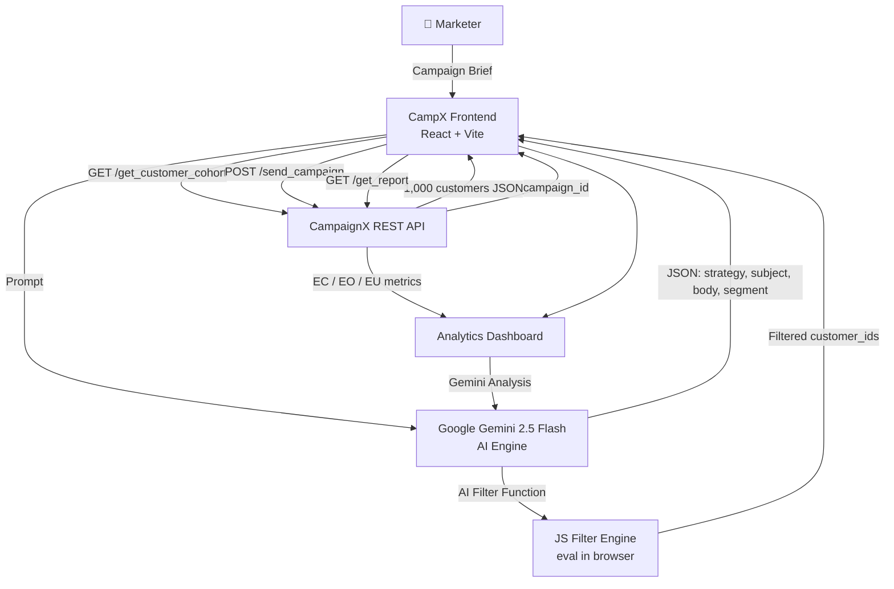
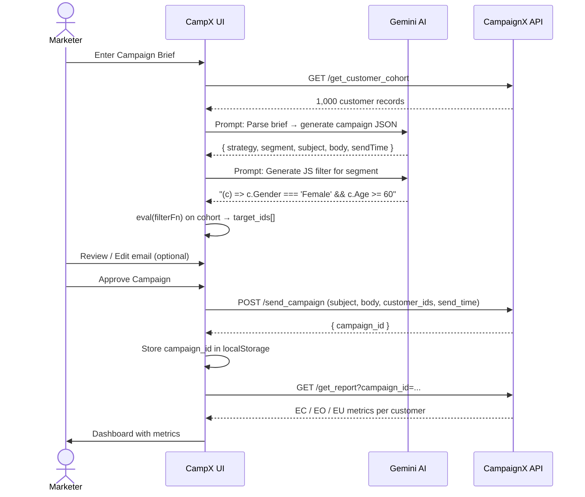

# System Architecture — CampX

## Overview

CampX is a single-page React application that orchestrates a multi-step AI-assisted marketing pipeline. It acts as a **Brain Layer** between the human marketer, the AI model (Gemini), and the external campaign infrastructure (CampaignX APIs).

---

## High-Level Architecture Diagram

---

## Component Layers

### 1. Presentation Layer (React Frontend)

| Component | Responsibility |
|-----------|---------------|
| `CampaignWorkspace.jsx` | Main campaign creation, editing, and execution flow |
| `Dashboard.jsx` | Metrics visualization using Recharts |
| `AIInsightModal.jsx` | AI-powered analytics insight generation |
| `ScheduleSection.jsx` | Campaign scheduling UI |

**Key User Actions:**
- Enter brief → trigger AI generation
- Edit AI-generated email inline
- Approve and dispatch campaign
- View real-time analytics

---

### 2. AI Engine Layer (Google Gemini 2.5 Flash)

| Task | Prompt Type | Output |
|------|-------------|--------|
| Brief interpretation | JSON mode | `{ strategy, targetSegment, sendTime, subject, body }` |
| Demographic filter generation | Text mode | JS arrow function string e.g., `(c) => c.Age >= 60` |
| Campaign insights | JSON mode | Array of 3 insight objects |

- **SDK**: `@google/genai` v1 (Node-compatible, browser-safe)
- **Response enforcement**: `responseMimeType: "application/json"` prevents markdown wrapping

---

### 3. API Integration Layer (CampaignX)

| Endpoint | Direction | Purpose |
|----------|-----------|---------|
| `GET /api/v1/get_customer_cohort` | CampX → CampaignX | Fetch live customer data |
| `POST /api/v1/send_campaign` | CampX → CampaignX | Dispatch email campaign |
| `GET /api/v1/get_report` | CampX → CampaignX | Fetch EC/EO performance data |

- **Auth**: `X-API-Key` header
- **Rate Limit**: 100 requests/day (managed carefully)

---

### 4. State Management Layer

CampX uses **React local state** (no Redux) with a custom `useRealData` hook for analytics.

| State | Location | Purpose |
|-------|----------|---------|
| `campaign` | `CampaignWorkspace` | AI-generated campaign object |
| `rawCohort` | `CampaignWorkspace` | Live customer array from API |
| `isEditingEmail` | `CampaignWorkspace` | Toggle between preview/edit mode |
| `emailSubject / emailBody` | `CampaignWorkspace` | Editable email content |
| `metrics` | `useRealData` hook | Aggregated dashboard metrics |
| `chartData` | `useRealData` hook | Time-series and segment data |

---

### 5. Data Persistence Layer

| Storage | What | Why |
|---------|------|-----|
| Browser `localStorage` | `campaignx_history` array of campaign IDs | Persistent campaign tracking across sessions |
| `localStorage` | `gemini_api_key` (optional override) | Settings page key override |

---

## Data Flow: Brief to Campaign

---

## Technology Justifications

| Decision | Rationale |
|----------|-----------|
| **React + Vite** | Fast HMR, minimal config, production-ready build |
| **Gemini 2.5 Flash** | Fast inference, strong JSON output, excellent instruction-following |
| **`@google/genai` SDK** | Reliable browser-compatible SDK with `responseMimeType` support |
| **No backend** | CampaignX APIs are accessible from browser; keeps architecture simple |
| **localStorage for history** | Avoids need for database while persisting campaign IDs across refreshes |
| **eval() for filter** | Allows Gemini to dynamically generate any demographic filter logic |
